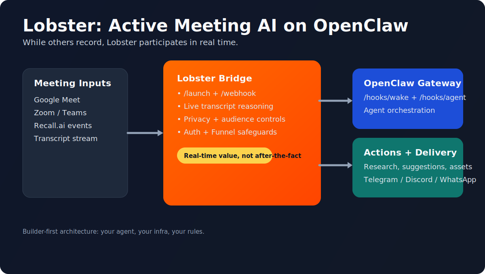
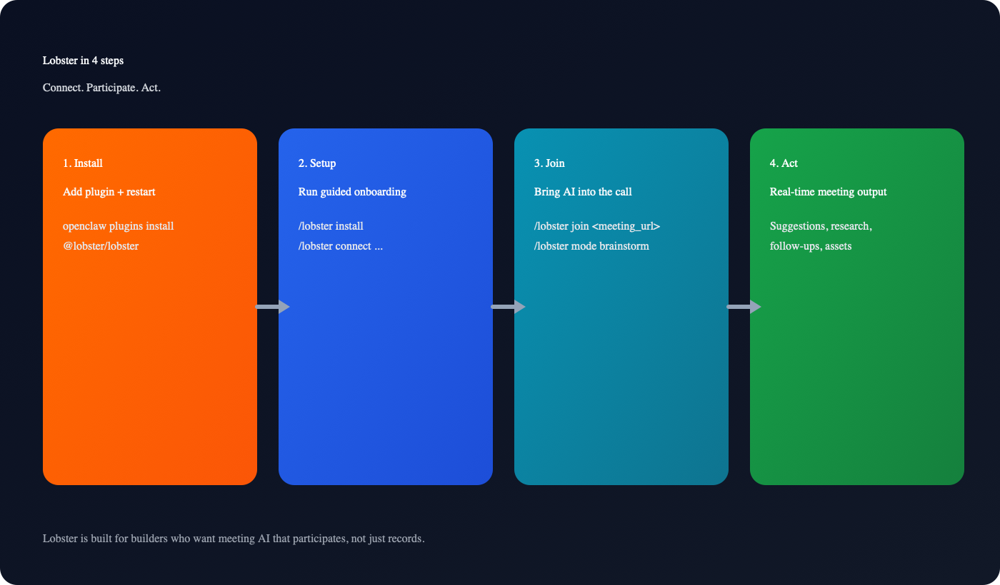

# Lobster

Meeting AI that participates, not just records.

<p align="center">
  <a href="./AGENT_GUIDE.md"></a>
  <a href="./INSTALL_AGENT_PROTOCOL.md"></a>
  <a href="./SECURITY.md"></a>
  <a href="./CHANGELOG.md"></a>
</p>

Lobster extends your OpenClaw assistant into live meetings. It converts transcript flow into real-time suggestions, research, and action while conversations are still happening.

Quick links: [Quickstart](#quickstart-tldr) | [Core Workflows](#core-workflows) | [Architecture](#architecture-at-a-glance) | [Agent Guide](./AGENT_GUIDE.md) | [Troubleshooting](#troubleshooting-fast-index)



## Quickstart (TL;DR)

Runtime assumptions:

- OpenClaw is already installed and authenticated.
- Node.js 18+ is available where the bridge runs.
- Recall.ai API key is available.
- Tailscale Funnel URL is available (`https://<node>.ts.net`).

1. Install plugin and restart gateway:

```bash
openclaw plugins install @lobster/lobster
openclaw daemon restart
openclaw plugins info lobster
```

2. In chat, run guided setup:

```text
/lobster install
```

3. Bootstrap bridge runtime:

```bash
./scripts/bootstrap-recall.sh
cd services/clawpilot-bridge
set -a; source ./.env; set +a
npm install
npm start
```

4. Verify health:

```bash
curl -s http://127.0.0.1:3001/health
```

## Why Lobster

| Dimension | Lobster | Passive Meeting Recorders |
| --- | --- | --- |
| AI behavior | Participates during the meeting | Records and summarizes after |
| Intelligence model | Your existing OpenClaw agent | Vendor-managed generic model |
| Control | Your infrastructure and policies | SaaS-hosted defaults |
| Timing of value | In the moment decisions are made | Delayed post-call notes |
| Audience fit | AI-native builders and operators | Team-wide generic workflows |

Core promise: while others record your meetings, Lobster participates in them.

## Core Workflows

### 1. Install and connect

Chat-first path:

```text
/lobster install
/lobster connect https://<node>.ts.net --token <BRIDGE_API_TOKEN>
```

Terminal preflight path:

```bash
./scripts/require-tailscale-funnel.sh
RUN_VPS_AUTH_CHECK=true npm run qa:quick-checks
```

### 2. Join and participate

```text
/lobster join https://meet.google.com/abc-defg-hij
/lobster join https://meet.google.com/abc-defg-hij --name "Dan's Lobster"
/lobster mode brainstorm
/lobster audience private
/lobster transcript on
```

### 3. Check runtime state

```text
/lobster status
/lobster privacy
/lobster mode
```

### 4. Pause or recover

```text
/lobster pause
/lobster resume
/lobster install
```



## Architecture At A Glance

```text
Meeting Platform -> Recall.ai events -> Lobster Bridge -> OpenClaw hooks -> Routed output
```

Main components:

1. Plugin package: `packages/clawpilot-plugin`
2. Bridge service: `services/clawpilot-bridge`
3. Prompt pack: `services/clawpilot-bridge/prompts/lobster.md`
4. QA runbooks and templates: `qa/`

Operational model:

- Bridge ingests Recall webhook events.
- Transcript context is interpreted with mode/privacy constraints.
- Output is routed to OpenClaw hooks and channel adapters.
- Commands remain the control surface for install, status, and join behavior.

## Security and Control Defaults

Required controls:

1. Funnel alignment must pass (`https://*.ts.net` + matching bridge `/health`).
2. `BRIDGE_API_TOKEN` should be enabled for protected bridge routes.
3. Plugin token must match `BRIDGE_API_TOKEN`.
4. Sensitive context is private-by-default and reveal-gated.

Required env variables:

- `RECALL_API_KEY`
- `RECALL_API_BASE`
- `WEBHOOK_SECRET`
- `WEBHOOK_BASE_URL`
- `BRIDGE_API_TOKEN`

Recommended checks:

```bash
./scripts/require-tailscale-funnel.sh
npm run security:scan
npm run qa:quick-checks
```

## Troubleshooting Fast Index

1. Plugin not available:

```bash
openclaw daemon restart
openclaw plugins info lobster
```

2. Command fails with auth errors:

```bash
openclaw config set plugins.entries.lobster.config.bridgeToken "<BRIDGE_API_TOKEN>"
openclaw daemon restart
```

3. Bridge unreachable:

```bash
openclaw config get plugins.entries.lobster.config.bridgeBaseUrl
curl -s https://<node>.ts.net/health
```

4. Setup drift after reinstall/update:

```text
/lobster install
```

## Human Path vs Agent Path

Human-first docs:

- This README: `README.md`
- Setup narrative protocol: `INSTALL_AGENT_PROTOCOL.md`
- Bridge operational detail: `services/clawpilot-bridge/README.md`

Agent-first contract:

- Deterministic machine spec: `AGENT_GUIDE.md`

## Repository Map

- `packages/clawpilot-plugin`: Lobster plugin package.
- `services/clawpilot-bridge`: bridge receiver and routing service.
- `scripts/`: bootstrap, security, and QA automation.
- `qa/`: manual test plans, templates, and run artifacts.

## Release Notes and Contribution

- Contribution guide: `CONTRIBUTING.md`
- Changelog: `CHANGELOG.md`
- Security policy: `SECURITY.md`
- Releasing process: `RELEASING.md`

Lobster is built for builders who want AI that acts inside meetings, under their control.
